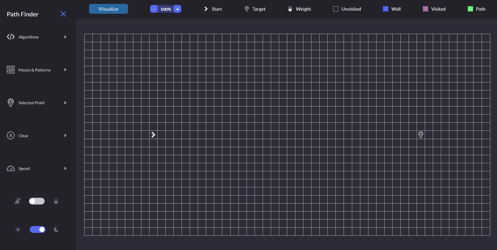
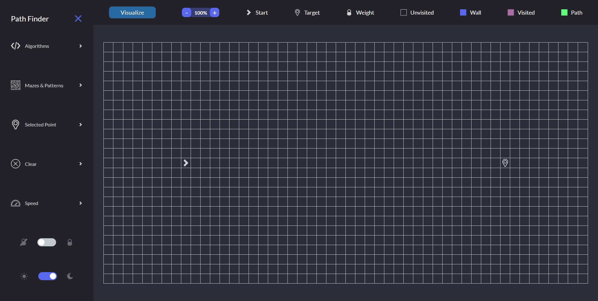
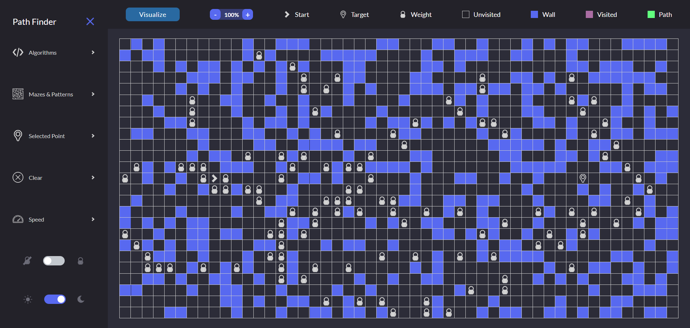

# Project Overview

## Table of contents

-  [Overview](#overview)
   -  [Features](#features)
   -  [UI Demo](#ui-demo)
   -  [Screenshots](#screenshots)
   -  [Links](#links)
-  [My process](#my-process)
   -  [Built with](#built-with)
   -  [What I learned](#what-i-learned)
   -  [Continued development](#continued-development)
   -  [Useful resources](#useful-resources)
-  [Author](#author)

## Overview

### Features

Users should be able to:

- Visualize a path finding algorithm using Dijkstra’s algorithm, A* search, greedy best‐first search, breadth‐first search, and depth first search
- Draw mazes and patterns using Recursive division, recursive division with horizontal skew, recursive division with vertical skew, random maze, and stair pattern
- Place walls, pitstops, and weights on the grid
- Zoom in and out of the grid
- Change the speed of the algorithm
- Clear the grid

### UI Demo

### Screenshots

***Desktop Layout*** (1440 X 900)\

### Links

- Repository URL: [Github Respository](https://github.com/jordan-na/path-finding-visualizer.git)
- Live Site URL: [Hosted on Github Pages](https://jordan-na.github.io/path-finding-visualizer/)

## My process

### Built with

- ReactJS
- CSS modules
- React components
- JSX
- Semantic HTML5 markup
- CSS custom properties
- Flexbox
- Grid

### Files Overview

- **React Components**
   - ***App***: The main component that contains all other
   - ***Grid***: The grid that contains the cells for which the algorithms will search in
   - ***Row***: A row of the grid containing cells
   - ***Cell***: A square of the grid that can be empty, a wall, a weight, a pitstop, or be visited/path
   - ***Header***: The header at the top of the app containing the zoom button and labels
   - ***ZoomButton***: Button to zoom in and out of the grid
   - ***Sidebar***: The sidebar in the desktop layout
   - ***SidebarControl***: The controls on the sidebar
   - ***ThemeToggle***: A toggle button to switch the theme between light and dark
- **Provider Components (context)**
   - ***ThemeProvider***: Provides the theme context to the children components
      - Used by **ThemeToggle** to change the theme
      - Every component has access to the theme context to change its color
   - ***ControlProvider***: Provides the control context to the children components
      - Provides state and behaviour related to the selected algorithm, selected point, and selected speed
   - ***DimensionsProvider***: Provides the dimensions of the visible grid and methods to zoom in and out
      - Used by **ZoomButton** to provide zoom capabilities
   - ***GridProvider***: Provides the state of the grid and the methods to perform the pathfinding and maze algorithms
- **Path Algorithms**
   - ***dijkstras-algorithm.js***: The algorithm to perform dijstra's algorithm
   - ***a-star-search.js***: The algorithm to perform A* search
   - ***greedy-best-first-search.js***: The algorithm to perform greedy best-first search
   - ***breadth-first-search.js***: The algorithm to perform breadth-first-search
   - ***depth-first-search.js***: The algorithm to perform depth-first search
- **Maze Algorithms**
   - ***recursive-division.js***: The algorithm to recursively divide maze
   - ***horizontal-skew-division.js***: The algorithm to recursive divide maze with horizontal skew
   - ***vertical-skew-division.js***: The algorithm to recursively divide maze with vertical skew
   - ***stair-pattern.js***: The algorithm to create stair pattern maze with random gaps in the stairs
   - ***random-maze.js***: The algorithm to create a random maze
- **Visualizers**
   - ***algorithm-visualizer.js***: Calls the path finding algorithms and visualizes them on the grid
   - ***maze-visualizer.js***: Calls the maze algorithms and visualizes them on the grid
- **Utils**
   - ***Storage.js***: Provides an interface to access the LocalStorage API using JSON
   - ***ToolsCSS.js***: Provides CSS utility methods

### What I learned

- How to represent a graph as a grid
- How graph traversal algorithms work
- How maze algorithms work
- The ability to use state updates for animations

### Continued development

-  I will continue to learn react
-  The next step is to learn class based components as an alternative to funcional components

### Useful resources

-  [React](https://reactjs.org/) - This helped me by acting as a reference for the react library

## Author

-  Name: Jordan Na
-  Website - [Github Profile](https://github.com/jordan-na)
-  Frontend Mentor - [@jordan-na](https://www.frontendmentor.io/profile/jordan-na)
-  Email - jordster02@gmail.com